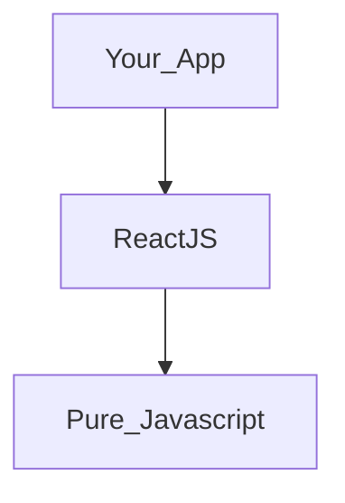
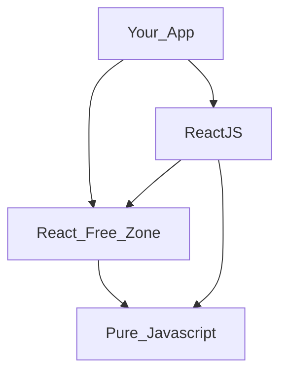

# 𝗥𝘅𝑓𝑥

𝗥𝘅𝑓𝑥 is effect and state management made simple, safe, and framework independent. Implemented as a family of libraries, the primary of which are `@rxfx/service` and `@rxfx/effect` and `@rxfx/bus`

Install like this:

```
npm install -S @rxfx/service
```

# Why Use It?

In a typical Front-end app, almost everything you write (custom hooks, components with effects) is "in React" - and thus vulnerable to major-version breakage. You always have to ask of every dependency - "Is it compatible with React 18|19?"



But if you carve out a React-Free Zone in your app, this layer is testable without React, and will always work the same no matter which version of React (or Angular, or Svelte or Vue!) you use it with. Always. Consider bugs that have been introduced by React core changing the timing of its execution. (TODO Example).



RxFx, by wrapping the capable and platform-independent RxJS, brings platform independent code execution to all environments. Its inherent support for streaming, cancelation, concurrency, and error handling and debugging make it an ideal tool for a Conversational UX era, where Promises and existing tools fail to handle these complexities.

# How It Works / Looks

The main call styles are shown, for the example of calling a function called `playBellAudio` which returns a Promise or Observable:

### Effect

```ts
import { createEffect } from "@rxfx/effect";
const ringEffect = createEffect(playBellAudio); // or createQueueingEffect

ringEffect();
```

### Bus

```ts
import { defaultBus as bus } from "@rxfx/bus";
const RING = createEvent<void>("bell/ring");
bus.listen(RING, () => playBellAudio); // or bus.listenQueueing

bus.trigger(RING());
```

### Service

```ts
import { createService } from "@rxfx/service";
const ringService = createService("bell", playBellAudio);

ringService.request();
```

See the individual libraries for more.

# Libraries

- [`rxfx`] - An all-batteries included library, rolling up all the others execpt the view-layer specific `@rxfx/react`
- [`@rxfx/effect`](https://github.com/deanrad/rxfx/tree/main/effect) - UI Framework-independent effect execution, streaming, concurrency and cancelation.

- [`@rxfx/service`](https://github.com/deanrad/rxfx/tree/main/service) - UI Framework-independent effect manager and state manager, ala NgRx, Redux Saga, or Redux Toolkit. Execute and cancel effects, and provide reactive state changes on their lifecycle events.

- [`@rxfx/bus`](https://github.com/deanrad/rxfx/tree/main/bus) - A Low-level effect execution and event observation with ordering, concurrency, and error isolation.

- [`@rxfx/react`](https://github.com/deanrad/rxfx/tree/main/react) Hooks for using bus or listeners, or general RxJs Observables inside of React Components.

- [`@rxfx/after`](https://github.com/deanrad/rxfx/tree/main/after) A utility for introducing delays, or creating scripts of delays.

- [`@rxfx/perception`](https://github.com/deanrad/rxfx/tree/main/perception) - Constants and functions related to human response times and perception thresholds of our various senses.

- [`@rxfx/animation`](https://github.com/deanrad/rxfx/tree/main/fsa) - A TypeScript/Observable version of [TweenJS](https://github.com/tweenjs/tween.js).

- [`@rxfx/fsa`](https://github.com/deanrad/rxfx/tree/main/fsa) - A re-publish of https://github.com/aikoven/typescript-fsa

- [`@rxfx/operators`](https://github.com/deanrad/rxfx/tree/main/operators) A collection of supplemental RxJS operators.

- [`@rxfx/ajax`](https://github.com/deanrad/rxfx/tree/main/ajax) `fetchMany` - gives you a Streaming Observable of a plural endpoint (e.g. `users/`) instead of the all-at-the-end delivery of Promises. (Is Cancelable too).

- [`@rxfx/peer`](https://github.com/deanrad/rxfx/tree/main/peer) - Can help a mesh of peers coordinate a single LEAD, even as peers come and go.

# Background

30 years after `setTimeout` introduced the world to the asynchronous nature of JavaScript, effect execution is still clumsy at best, and broken in many cases. And none of the popular front-end solutions (Angular, React, RxJS) present a complete solution that deals with all the concerns of async effects in a framework-independent way.

- Error handling that is predictable, and does not compromise the integrity of the app the more effects you add.
- Automatic `loading`/`active` state tracking.
- Automatic tracability of all lifecycle events of effects (`started`,`next`,`complete`,`error`, `canceled`, etc.)
- Simple effect cancelation from anywhere inside or outside the component tree.
- Seamless interopation with Promises, Observables, Iterables and generators.
- Easily reduced or adjustable concurrency (immediate, queueing, throttling, etc) without introducing complication or additional variables.

## How is 𝗥𝘅𝑓𝑥 a solution?

An 𝗥𝘅𝑓𝑥 service (or a bus) is a view-framework-independent, pure JS container for Effect Management and State Mangement, based on RxJS. An 𝗥𝘅𝑓𝑥 Service supports all the above pain points in an easy API.

## When is it time to introduce 𝗥𝘅𝑓𝑥?

- You notice you are introducing `loading` state fields which must be set and unset manually
- You are manually outputting logging messages, and there is no standard convention between them.
- You are using framework-specific constructs (`useEffect`, async pipe) to manage asynchrony.
- You want a better separation of the View Layer from the async layer.
- You are dealing with race conditions
- You are using RxJS, but want fewer imports and operators, and you're feeling it clumsy to manage subscriptions in addition to Observables.
- You are using React, and want to heed the warnings in their docs about `useEffect` being used often in the wrong ways.
- You are tired of async errors breaking the view layer, or the app as a whole, as more effects get added to your app.
- You find tests take too long to run when they have to be called through the view layer, and you want something that is testable independent of the view.

In short - if you believe there is a more concise, more airtight, race-condition-proof way to do async, you may have found it right here in an 𝗥𝘅𝑓𝑥 service or bus listener.

# Concurrency Modes

Race conditions are easily prevented when code is set to run in the correct Concurrency Mode for its use case. With 𝗥𝘅𝑓𝑥, its easily named and tested modes (which use RxJS operators underneath) allow you to keep your code readable, and you can eliminate race conditions in a 1-line code diff.

Choose your mode by answering this question:

_If the effect is running, and a new request arrives, should we:_

- Begin the new effect at once, allowing both to finish in any order. (Immediate mode, ala `createService`)
- Begin the new effect only after any currently running effects, preserving order. (Queueing mode, ala `createQueueingService`)
- Prevent/throttle the new effect from beginning. (Blocking mode)
- Cancel the currently running effect and begin the new effect at once. (Switching mode)

And one final mode, seldom used, but included for completion:

- Cancel the currently running effect, and don't begin a new effect. (Toggling mode)

Here are representations of each mode:


Download [SVG](https://d2jksv3bi9fv68.cloudfront.net/rxfx/cards-all-2024.svg)
