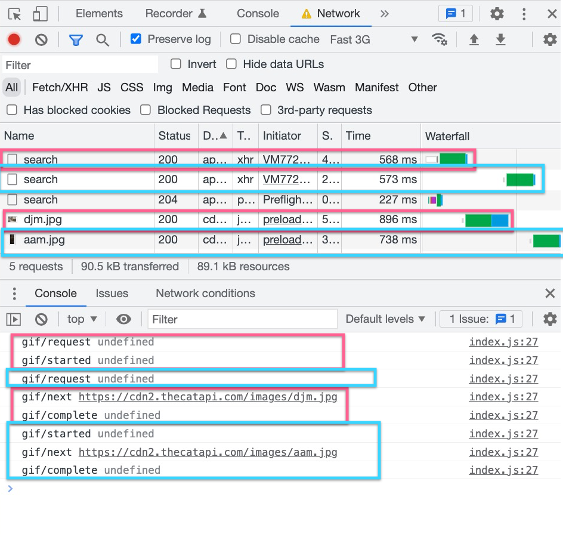

# Enhancing Usability For Older Users

## For JavaScript developers who code for older or special-needs users.

---

Problems:

- Usability issues are Magnified
- Framework support for usability principles is absent.
- It's not that we don't want to do these things - but it's not easy with current tools.


---

<!--
# Interaction Design

> Interaction Design focuses on the interactive behaviors of an app - like displaying loading and error states, progress and activity indicators, and animation.

---

# TL;DR Transparency, Robustness, Efficiency!

---

# 5 Principles of Interaction Design

- Acknowledgement: So the user feels a sense of Progress.
- Animation: So the user feels a sense of continuity.
- Concurrency: So the user feels the app is robust.
- Cancelation: So the user can change their mind.

---
-->

# Example - Kitty Factory ([Live](https://codesandbox.io/s/rxfx-service-example-kitty-factory-initial-8cqsdd))


---

# Example - Kitty Factory - Issues!

- Acknowledgement Of Button Press (Activity, Animation)
- Double-taps / Race Conditions (Concurrency)
- Get Stuck or Waste Resources (Cancelation)

---

# Kitty Factory (w/ Affordances)

- [Live Demo](https://zpgdgg.csb.app/)

---

# Coding Objectives

- Use `@rxfx/*` packages for easy, configurable effects. (PureJS, framework-agnostic)
- Use Observables (RxJS) to create and sequence cancelable behaviors-over-time.
- Use published constants to represent user-centered time durations.
- Implement cancelation 'transparently'.

---

# Issue #1 - No Activity Indicator ⏳

## The `{ isActive }` property of `@rxfx/service`

^ If my mom doesn't see a button react upon a press - should she press it again?

---

# `@rxfx/service` Architecture


---

## The `.isActive` property

```ts
import { useService } from "@rxfx/react";
import { gifService } from "./services/gifService";

export function NextCatButton() {
  const { isActive } = useService(gifService);
  return (
    <button
      onClick={() => gifService.request()}
    >
      {isActive ? "Fetching." : "Next Cat >>️"}
    </button>
    <HourglassSpinner show={isActive} />
  );
}

export function App() {
  const { state: { url } } = useService(gifService);
  return ...
      <Figure url={url} />
      <NextCatButton/>
}
```

---

## Service: An API to an Effect and its State

```ts
import { createService, createQueueingService } from "@rxfx/service";
import { defaultBus as bus } from "@rxfx/bus";
import { gifReducer } from "./gifReducer";

// A service will handle errors, activity, loading, cancelation
// Provides gifService.request(), .isActive and .state Observables
export const gifService = createService(
  "gif",
  bus,
  "gif", // namespace for actions requested,started,next,complete,error,etc
  bus, // bus to read consequences and requests from
  fetchRandomGIFPromised, // the Promise-or-Observable-returning effect function
  (ACTIONS) => gifReducer(ACTIONS) // the reducer for non-transient state
);

// Bonus: bus.spy(console.log)
```

---

## Use an Effect Function

```ts
function fetchRandomGIFPromised(): Promise<string> {
  return fetch("https://api.thecatapi.com/v1/images/search")
    .then((res) => res.json())
    .then((data) => data[0].url);
}
```

---

## Use A Reducer for Non-Transient State

```ts
const initialState = { url: "http://somewhere/startup-kitty.png" };

export const gifReducer =
  (ACTIONS) =>
  (state = initialState, e = {}) => {
    switch (e.type) {
      case ACTIONS.next.type:
        return { ...state, url: e.payload };
      default:
        return state;
    }
  };
```

---

# Kitty Factory Demo - Activity Indicator

---

# Issue #1.1 - Animating the Button on Press

---

### Animate <NextCatButton/> on `gifService` requests

- A duration (`@rxfx/perception`)
- A source of time/animation frames (`@rxfx/animation`)
- An event listener for when to run (`@rxfx/bus`)
- An effect that is scoped to the button's lifetime (`@rxfx/react`)

---

# Kitty Factory Demo - Animating the Button

---

# Kitty Factory Demo - Making the Button Discoverable

---

# Issue #1 Acknowledging Activity/Press - Solved!

---

# Issue #2 - Dead-time during Image Load

^ Will my mom think it's broken if it's not active but still loading?

---


---

# Factor a preloader into `.isActive`

```diff
function fetchRandomGIFPromised() : Promise<string> {
  return fetch("https://api.thecatapi.com/v1/images/search")
    .then((res) => res.json())
    .then((data) => data[0].url)
+   .then(preloadImagePromised)
```

---

# Write the Promise-returning preloader

```ts
function preloadImagePromised(url) {
  return new Promise((resolve) => {
    const img = new Image();
    img.onload = () => resolve(url); // <-- the consumer needs the url
    img.src = url;
  });
}
```

---

# Kitty Factory Demo - Preloaded Images

---

# Issue #2 Solved - Preloaded to remove 'dead' time

---

# Issue #3 - Double Taps and Race Conditions

^ If my mom double-taps accidentally (or on purpose), will the result be confusing?

---

# Queueing?



^ But how hard will it be to add to my code?

---

# Change to Queueing

```diff
- export const gifService = createService("gif", bus,
+ export const gifService = createQueueingService("gif", bus,
  "gif", // namespace for actions requested,started,next,complete,error,etc
  bus, // bus to read consequences and requests from
  fetchRandomGIFPromised, // the Promise-or-Observable-returning effect function
  (ACTIONS) => gifReducer(ACTIONS) // the reducer for non-transient state
);
```

---

# Prevent double-loading, instead?

- `createQueueingService` => `createBlockingService`
- Block at UI level using `{ isActive }`

---

# Kitty Factory Demo - Queueing Downloads

---

# Issue #3 Solved - The Double Tap Problem!

---

# Issue #4 - Uncancelability

^ On her underpowered Consumer Cellular phone, will long load times be retry-able,
or cancelable?

---

# Cancel on User Button Press\*

```ts
<button onClick={() => gifService.cancelCurrent()}>Cancel</button>
```

- (Cancelation requires the service handler return an Observable)

---

# Cancel on User Button Press - Observable endpoint

```ts
import { ajax } from "rxjs/ajax"; // cancelable version of fetch

function fetchGIF() {
  return ajax({
    url: "https://api.thecatapi.com/v1/images/search",
    method: "GET",
  }).pipe(map((r) => r.response[0].url));
}

// Define the service around this function
const gifService = createQueueingService("gif", bus, fetchGIF);
```

---

# Cancel on User Button Press - Observable Preloader

```ts
export function preloadImage(url) {
  return new Observable((notify) => {
    const img = new Image();

    img.onload = () => {
      notify.next(url);
      notify.complete();
    };

    img.src = url;

    return () => {
      img.src = EMPTY_GIF;
    }; // causes browser to cancel the img load!
  });
}
```

---

# Cancel on User Button Press - Chain Preloader

```diff
function fetchAndPreloadGIF() {
  return ajax({
    url: "https://api.thecatapi.com/v1/images/search",
    method: "GET"
  }).pipe(
    map((r) => r.response[0].url)
+   mergeMap(preloadImage)
  );
}
```

---

# Kitty Factory Demo - Cancel Button

---

# Canceling at Unmount

```ts
// useWhileMounted is same as useEffect with []
useWhileMounted(() => {
  // trigger demo upon mount
  gifService.request();

  // clean up fully on unmount
  return () => {
    gifService.cancelCurrentAndQueued();
  };
});
```

---

# Kitty Factory Demo - Cancel at Unmount

---

# Canceling on a Timeout (2 Deep Breaths)

```diff
export const gifService = createService(
  "gif", // namespace for actions requested,started,next,complete,error,etc
  bus, // bus to read consequences and requests from
-  fetchRandomGIF,
+  timeoutHandler({ duration: THRESHOLD.DeepBreath * 2 }, fetchRandomGIF),
  (ACTIONS) => gifReducer(ACTIONS) // the reducer to aggregate non-transient state
);

```

---

# Kitty Factory Demo - Cancel on Timeout

---

# Issue #4 Solved - Uncancelability

---

# Issue #5 - Animate Slide Transition

^ Would it be more calming and soothing if the images slid out ?

---

# Non-Animated

```ts
export const Figure = ({ url }) => {
  return (
    <div id="slide-container">
      <div className="slide cat">
        
      </div>
    </div>
  );
};
```

---

# Kitty Factory Demo - Slide Transition

## Find the race condition!

---

# Animated, Queued

```ts
const SlideShow = ({ url }) => {
  useWhileMounted(() =>
    bus.listenQueueing(NEW_SLIDE.match, ({ payload: url }) => {
      // ...
      existing.current.style.setProperty("transform", `translateX(-${x}vw)`);
    })
  );

  return (
    <div id="slide-container">
      <div ref={existing} className="slide cat">
        
      </div>
    </div>
  );
};
```

---

# Issue #5 Solved - Animate Slide Transition

---

# In Conclusion - We Fixed

- Acknowledgement: So the user feels a sense of Progress.
- Animation: So the user feels a sense of continuity.
- Concurrency: So the user feels the app is robust.
- Cancelation: So the user can change their mind.

---

# Thank You! 🎉

## Sources

- Chat GPT: "What are some UX techniques to help elderly users?"
- [Nielsen Usability Heuristics](https://media.nngroup.com/media/articles/attachments/Heuristic_Summary1_A4_compressed.pdf)
- 𝗥𝘅𝑓𝑥 on [Github](https://github.com/deanrad/rxfx/tree/main/bus)

<!--

# Activity


---

# Animation


---

# Cancelation


---

# Timeouts


---

# Animation - Slide Transition


---

-->